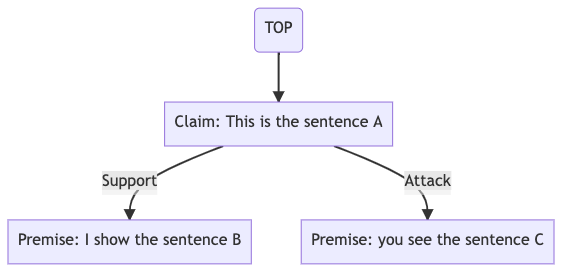
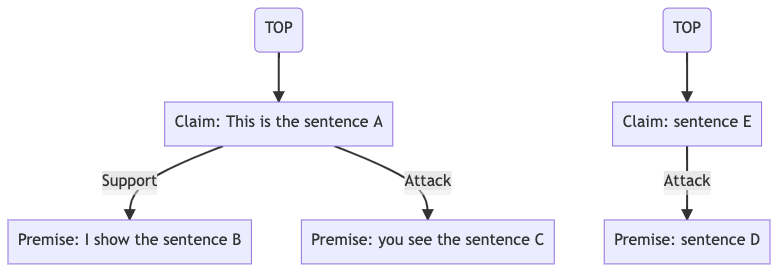
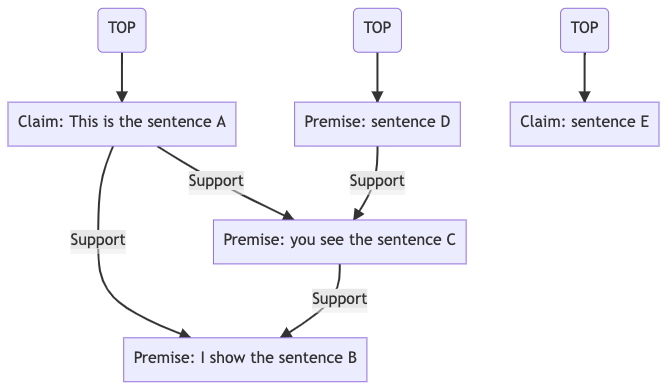

# Example of data format

## Data format (.mrp)

The data format of training, validation and test files should follow [MRP format](http://mrp.nlpl.eu/2020/index.php?page=14#:~:text=Uniform%20Graph%20Interchange%20Format) which was introduced in the CoNLL 2019 and 2020 shared tasks.
MRP follows <b>jsonline</b>, where each json line contains graph information such as:

| Key | Description |
| --- | --- |
| id  | The unique string ID of this graph |
| input | The input text |
| framework | The corpus name. In the multi-task learning, one framework is considered as a <it>task</it>.
| time | Any time (e.g., date of data acquisition or data pre-processing) |
| flavor | The flavor type of MRP. This should be always 0 in our library. |
| nodes | The list of nodes (i.e., components or propositions). <br>```id```: The unique integer ID of this node.<br>```label```: The label of this node.<br>```anchors```: The text span of this node (although this is a list, we only support one element). |
| edges | The list of edges (i.e., relations).<br>```source```: The source node ID.<br>```target```: The target node ID.<br>```label```: The label of this edge.  |
| tops | The list of top node IDs (i.e., root node IDs) |

Different from original MRP format, one should not contain ```properties``` and should not use overlap anchors.
In each line

### Example1: Tree

example1.mrp
``` json
{"id": "001", "input": "This is the sentence A. I show the sentence B. Finally, you see the sentence C.", "framework": "sample_tree_corpus", "time": "2020-08-05", "flavor": 0, "language": "en", "version": 1.0, "provenance": "temp", "source": "tmp", "nodes": [{"id": 0, "label": "Claim", "anchors": [{"from": 0, "to": 22}]}, {"id": 1, "label": "Premise", "anchors": [{"from": 24, "to": 45}]}, {"id": 2, "label": "Premise", "anchors": [{"from": 56, "to": 78}]}], "edges": [{"source": 0, "target": 1, "label": "Support"}, {"source": 0, "target": 2, "label": "Attack"}], "tops": [0]}
{"id": "002", ...}
...
```

Each line contains a graph representation as follows:
```bash
$ head -1 example1.mrp | jq .
{
  "id": "001",
  "input": "This is the sentence A. I show the sentence B. Finally, you see the sentence C.",
  "framework": "sample_tree_corpus",
  "time": "2020-08-05",
  "flavor": 0,
  "language": "en",
  "version": 1,
  "provenance": "temp",
  "source": "tmp",
  "nodes": [
    {
      "id": 0,
      "label": "Claim",
      "anchors": [
        {
          "from": 0,
          "to": 22
        }
      ]
    },
    {
      "id": 1,
      "label": "Premise",
      "anchors": [
        {
          "from": 24,
          "to": 45
        }
      ]
    },
    {
      "id": 2,
      "label": "Premise",
      "anchors": [
        {
          "from": 56,
          "to": 78
        }
      ]
    }
  ],
  "edges": [
    {
      "source": 0,
      "target": 1,
      "label": "Support"
    },
    {
      "source": 0,
      "target": 2,
      "label": "Attack"
    }
  ],
  "tops": [
    0
  ]
}
```

The above json shows an example of an argumentative tree composed of following relations:
- ```I show the sentence B``` supports ```This is the sentence A```
- ```you see the sentence C``` attacks ```This is the sentence A```




### Example2: Trees

```bash
$ head -1 example2.mrp | jq .
{
  "id": "001",
  "input": "This is the sentence A. I show the sentence B. Finally, you see the sentence C. Although sentence D, sentence E!",
  "framework": "sample_trees_corpus",
  "time": "2020-08-05",
  "flavor": 0,
  "language": "en",
  "version": 1,
  "provenance": "temp",
  "source": "tmp",
  "nodes": [
    {
      "id": 0,
      "label": "Claim",
      "anchors": [
        {
          "from": 0,
          "to": 22
        }
      ]
    },
    {
      "id": 1,
      "label": "Premise",
      "anchors": [
        {
          "from": 24,
          "to": 45
        }
      ]
    },
    {
      "id": 2,
      "label": "Premise",
      "anchors": [
        {
          "from": 56,
          "to": 78
        }
      ]
    },
    {
      "id": 3,
      "label": "Premise",
      "anchors": [
        {
          "from": 89,
          "to": 99
        }
      ]
    },
    {
      "id": 4,
      "label": "Claim",
      "anchors": [
        {
          "from": 101,
          "to": 111
        }
      ]
    }
  ],
  "edges": [
    {
      "source": 0,
      "target": 1,
      "label": "Support"
    },
    {
      "source": 0,
      "target": 2,
      "label": "Attack"
    },
    {
      "source": 4,
      "target": 3,
      "label": "Attack"
    }
  ],
  "tops": [
    0,
    4
  ]
}
```




### Example3: Graph

```bash
$ head -1 example3.mrp | jq .
{
  "id": "001",
  "input": "This is the sentence A. I show the sentence B. Finally, you see the sentence C. Although sentence D, sentence E!",
  "framework": "sample_graph_corpus",
  "time": "2020-08-05",
  "flavor": 0,
  "language": "en",
  "version": 1,
  "provenance": "temp",
  "source": "tmp",
  "nodes": [
    {
      "id": 0,
      "label": "Claim",
      "anchors": [
        {
          "from": 0,
          "to": 22
        }
      ]
    },
    {
      "id": 1,
      "label": "Premise",
      "anchors": [
        {
          "from": 24,
          "to": 45
        }
      ]
    },
    {
      "id": 2,
      "label": "Premise",
      "anchors": [
        {
          "from": 56,
          "to": 78
        }
      ]
    },
    {
      "id": 3,
      "label": "Claim",
      "anchors": [
        {
          "from": 89,
          "to": 99
        }
      ]
    },
    {
      "id": 4,
      "label": "Claim",
      "anchors": [
        {
          "from": 101,
          "to": 111
        }
      ]
    }
  ],
  "edges": [
    {
      "source": 0,
      "target": 1,
      "label": "Support"
    },
    {
      "source": 0,
      "target": 2,
      "label": "Support"
    },
    {
      "source": 2,
      "target": 1,
      "label": "Support"
    },
    {
      "source": 3,
      "target": 2,
      "label": "Support"
    }
  ],
  "tops": [
    0,
    3,
    4
  ]
}
```


